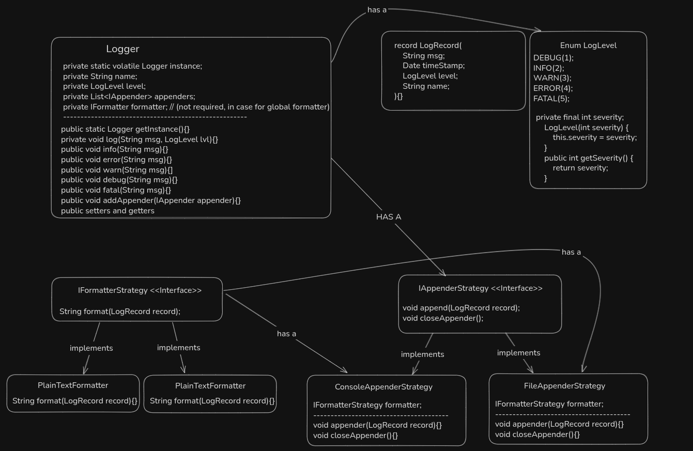
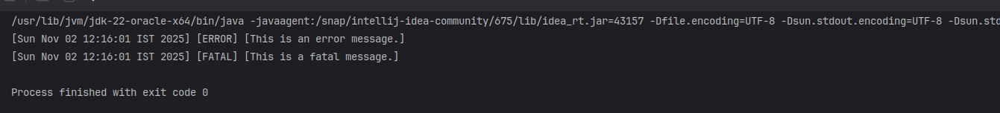
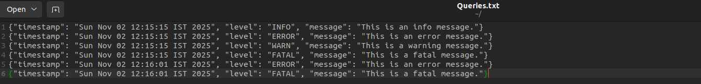

# LOGGING SYSTEM
This project implements a **custom logging system** that provides flexible, pluggable, and extensible logging mechanisms for applications.  
It allows developers to log messages in different formats (e.g., plain text, JSON) and levels (INFO, DEBUG, ERROR, etc.) with minimal coupling between log message structure and output strategy.

The design supports **plug-and-play** log formatting and output handling, making it easy to adapt to various logging requirements.

## REQUIREMENTS
* System should support multiple logging levels like (DEBUG, INFO, WARN, ERROR, FATAL etc..)
* Allow switching between different log formats (eg: PlainTextFormat, JsonFormat etc..)
* Allow writing logs to multiple destinations like Console, File, DB etc..
* Should support log hierarchy eg:
    if loglevel is choosen as WARN. only logs which are equal or above the choosen level should be logged out.
* Should be thread safe.

## APPROACH AND DESIGN PATTERNS

### Strategy Pattern for Log Appenders:
* Encapsulates different Log Appending Strategies.
* Allows runtime selection of Log appenders (Console, File etc.)
* Makes it easy to add new Appender options

### Strategy Pattern for Log Formatters:
* Encapsulates different Log formatting strategies
* Allows to choose different formatter for different appenders
* Easy to new formatter or delete an old formatter

### Singleton Pattern for Logger Instance:
* Provides a global access point to the logging system
* Ensures consistent configuration across the application

### Observer pattern for dispatching logs to multiple appenders 
* Helps to dispatch logs to multiple destinations
* Allows to append the logs asynchronously using queues for specific appenders (eg: file or db)

## CLASS DIAGRAM

## OUTPUT

### Console output

### File output

## EXTENSIBLE REQUIREMENTS
* **Support Multiple Service Logging:**
  - Enable service-based logging configurations (e.g., `AppService`, `PaymentService`, etc.).
  - Each service can maintain its own log level, format, and output destination.

* **Configuration-Driven Setup:**
  - Allow logger behavior (level, format, appenders) to be defined via external config files (e.g., JSON/YAML) for flexibility without code changes.

* **Filtering spacific loglevel**
  - If filter specific loglevel is choosed, then those logs should be printed irrespective of Hirerachical loglevel
  - Use CHAIN OF RESPONSIBILITY design patter to achieve this