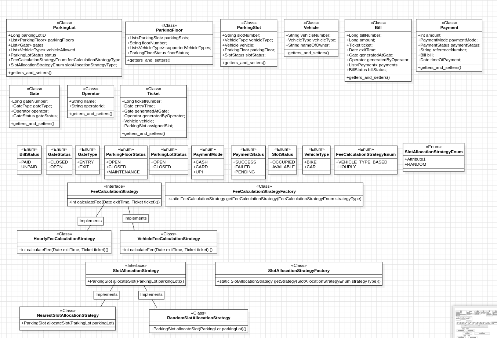

# Low Level Design of ParkingLot
A parking lot management system is designed to handle the operations of parking vehicles, collecting payments, and managing available space efficiently. The system should be able to accommodate different types of vehicles, provide payment options, and ensure a smooth user experience.

## Rules of the parking lot system (Inacting the system)
* The system will manage different types of vehicles.
* There will be multiple entry gates and multiple exit gates
* At each gate there will be an operator
* A vehicle enters in one of the entry gates and leaves in one of the exit gates
* A ticket will be issued at the time of the entry and the fee should be paid at the time of the exit
* According to the system choice a slot should be allocated for that vehicle
* Multiple payment methods should be supported like (cards, cash, upi etc..)
* Once the payment is successfull, the vehicle is allowed to exit, and the parking slot is freed.

## Illegal action
* A vehicle cannot park in an already occupied slot.
* Vehicles cannot vacate without completing the payment process.
* Vehicle only with allowed type can park

## Models

## Design Challenges
1. Efficient Slot Allocation: Ensuring vehicles are assigned to the correct slot type.

2. Tracking Vehicle Duration: Keeping a record of entry times for payment calculations.

3. Handling Payments: Supporting multiple payment methods dynamically.

> Note: handling multiple vehicle entry should be handled
4. Managing Concurrency: Ensuring simultaneous vehicle entries and exits are handled properly.

## Desing Patterns
1. Strategy Pattern for slot allocation
    * NearestSlotAllocation
    * RandomSlotAllocation
    * VehicleBasedSlotAllocation
2. Strategy pattern for FeeCalcuation
    * HourlyBasedFeeCalculation
    * VehicleBasedFeeCalculation
3. Factory Pattern for Vehicle Creation : (FYI - Not necessarily a CORE PART OF THE PROBLEM !!)