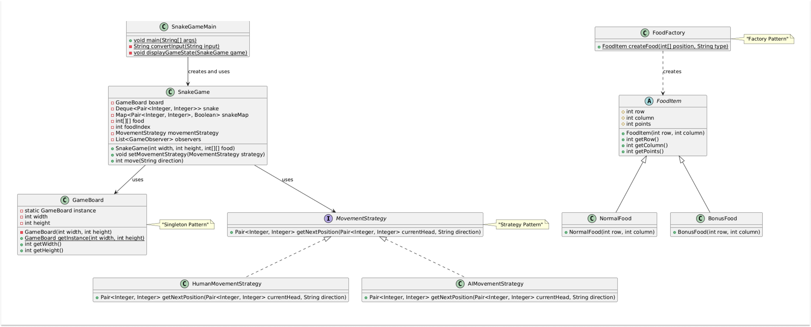
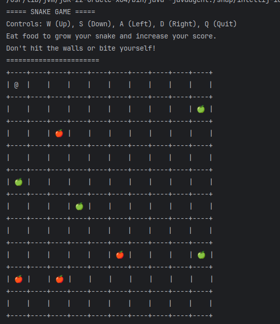
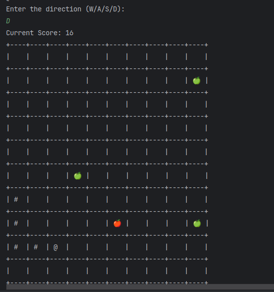

# Low-level design: Snake and Food
The Snake & Food game is a classic arcade game where the player controls a snake moving on a grid, attempting to eat food items while avoiding collisions. The game is simple in concept but requires strategic movement to maximize the snake's growth without running into walls or itself.

## Rules of the game
* The game is played on an N * M grid.
* The snake starts at an initial position with a small length.
* The player controls the movements Right, Left, Up, and Down.

## Game mechanics
* The snake moves one step at a time in the choosen direction.
* When the snakes eats a food item, it grows in length, and a new food item spawns at a random position on the grid.
* The game continue until the snake collides with the wall or itself, at which point the games ends.

## Requirements and clarification
* A snake moves in a grid-based environment.
* The player controls the snake's movement direction.
* The snake grows when it eats food.
* The game ends if the snake collides with a wall or itself.
* Tracks the game over.

## Entities
* Grid, Snake, Player, Food, Cell

## Patterns used
### Strategy pattern for players and foodplacement
* IMovementStrategy
* IFoodPlacementStrategy

### Factory pattern for food creation
* FoodFactory

## Idea behind snake movement
Used Deque<Cell\> to track the snake movement. Always front(left) of the deque will be snake's head and rear(right) end will be snake's tail. whenever snake eats a food, change the symbol of front cell in deque to "#"(which implies body), and a new cell with the symbol "@" in the front of the deque. 

if snakes moves to empty, remove the tail cell from deque and change the symbol of front cell to "#" and add new cell with symbol "@" implies head.

## Idea behind self collision
Using set<Cell\> to check the self collision. Set will contains the cell, whenever snake grows, just add a new cell into this set. Besides, whenever snake moves to new cell, just check does that cell already exist. if yes, collision

## Diagram

## Output

## Extensible requirements

> If snake reaches the edge of the wall, it should come from other side of the wall (no collisions)

> And notify the status of the game like score, etc..
NOTE: Can use observer pattern

> Use sigleton pattern to limit the board creation to one
