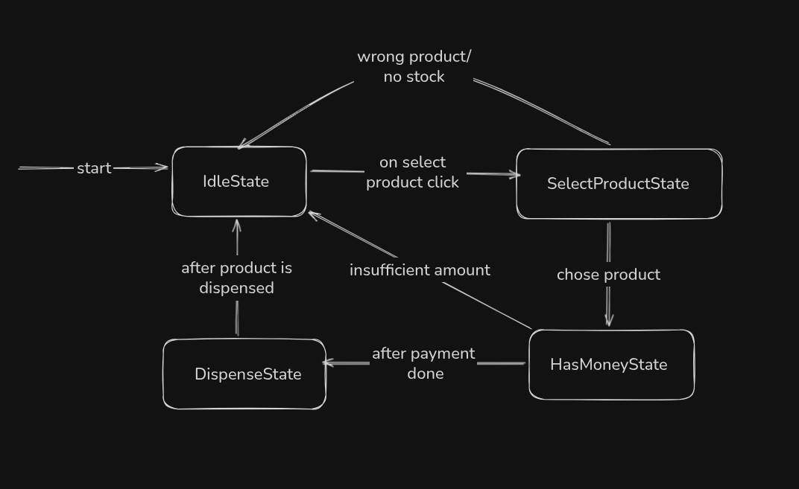
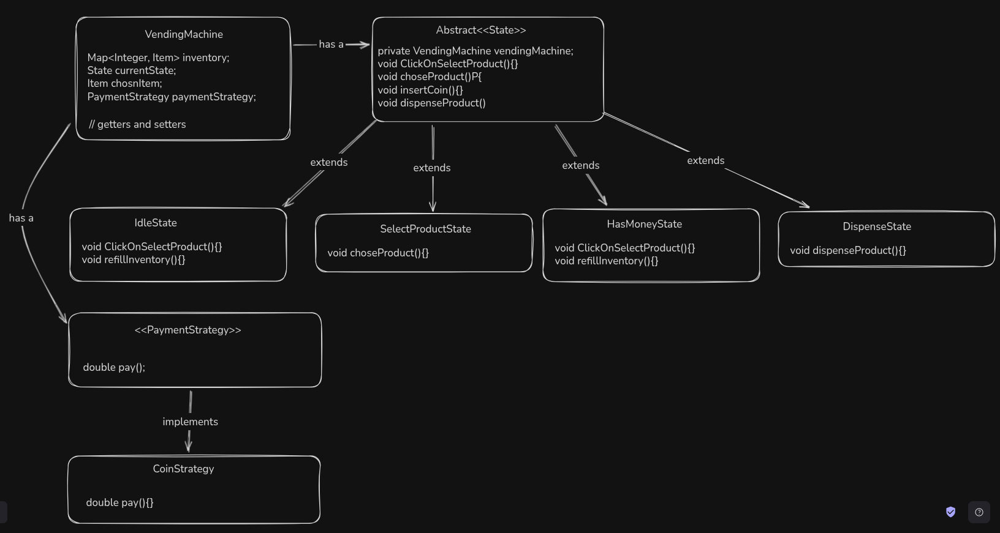
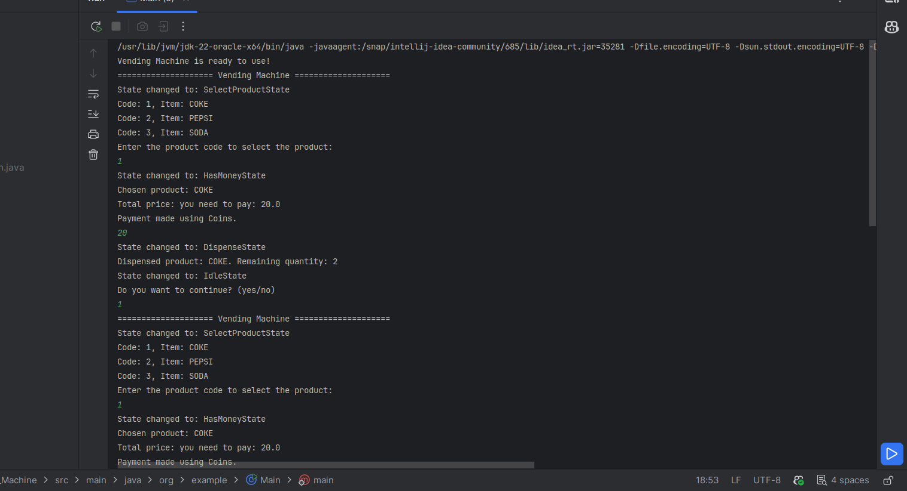

# VendingMachine LLD

A vending machine system is designed to efficiently manage product inventory, handle customer selections, process payments, and dispense products. The system needs to support multiple product types, manage inventory availability, handle various payment methods, and provide a seamless purchase experience. The system should be reliable and capable of handling different machine states and payment strategies.

## Requirements

 The system will manage products within a single vending machine.

• Users can browse, select, and purchase products based on their preferences.

• The system tracks product availability and prevents dispensing unavailable items.

• Payment processing is integrated for coin-based payments only.

• The system transitions through various states during the purchase cycle.

## Different states in machine

## UML diagram

## Design patterns
* State Design Pattern for different states.
* Strategy Design Pattern for payments.

## Sample output
